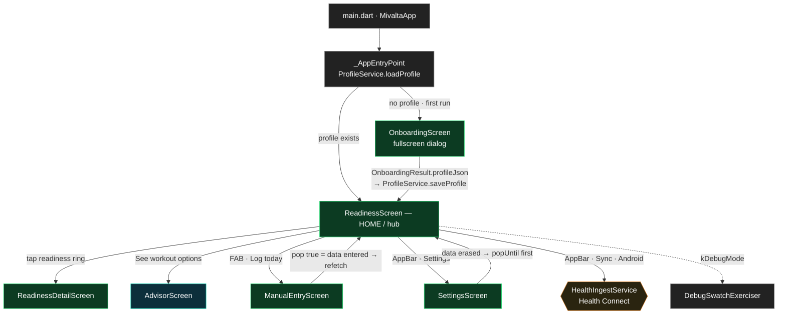
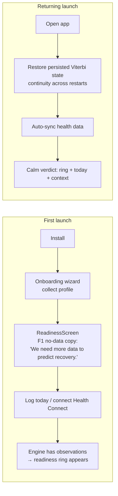
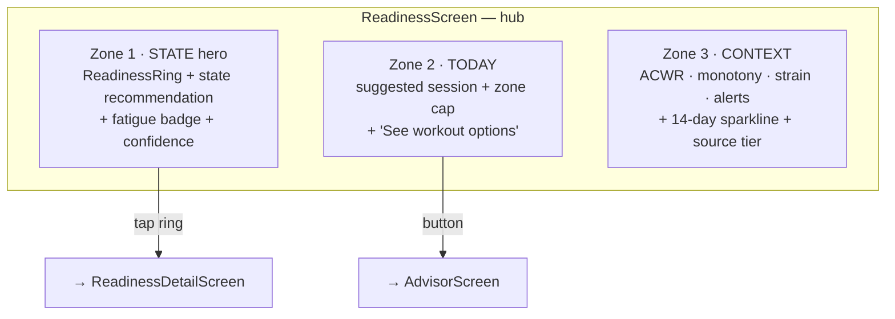
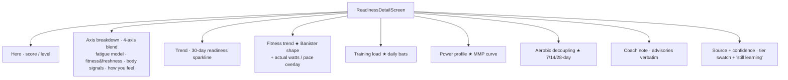
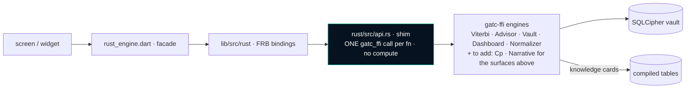

# MiValta Flutter — Frontend Flow, Screens & User Stories

Status: living map. Date: 2026-06-06. Source: **read from `lib/`** (current code, not spec).
Companion to `UI_FLOW.md` (wiring detail) and `UI_UX_DIRECTION.md` v1.4 (design intent, in
mivalta-rust-engine). Engine pin: `rust/Cargo.toml` → `gatc-ffi @ f5ab740`.

**Purpose of this doc:** give a single, honest picture of *what the app does today*, *as user
stories*, and *where Monitor + Advisory are heading* — so scope and progress are legible at a glance.

**The one rule every screen obeys:** the Rust engine **DECIDES/COMPUTES**, the FFI **PASSES
THROUGH**, Flutter **DISPLAYS**. No thresholds, math, or fabrication in Dart. The UI renders and
arranges; it never invents meaning the engine did not produce.

**Felt qualities (UI_UX_DIRECTION §1), in priority order:** CALM (quiet by default) ·
HONEST (uncertainty labelled, never masked) · AGENCY (every suggestion is a one-tap option).
MiValta sits at the **PULL pole** (Oura-like calm verdict), not the PUSH pole (Whoop-like nagging).

---

## 1. Tier model (what each tier is, who it's for)

| Tier | What it is | Josi? | Screens today |
|---|---|---|---|
| 🟢 **MONITOR** (free) | Rich, deterministic presentation of readiness **and** training-data analytics. Engine computes, Flutter displays. | No | Onboarding, Readiness (hub), Readiness Detail, Manual Entry, Settings |
| 🔵 **ADVISOR** | The interaction layer over Monitor's data: bounded A/B/C next-workout options the athlete picks; (planned) post-workout report + offered tips. | Yes (bounded) | Advisor |
| ⚪ **COACH** (post-beta) | Real planning / periodization / open conversation. **Out of scope now** (founder direction). | Yes (full) | — |

> **Focus now = MONITOR + ADVISOR (beta-MVP).** COACH is deferred until beta is live and real
> users are testing. The §7 "negotiation" and §8 "ask-anything" surfaces in UI_UX_DIRECTION are
> Coach-tier/post-MVP per DECISIONS Entry X.

---

## 2. Navigation flow (current, accurate to `lib/`)

## 3. User journey (first run vs returning)

---

## 4. Screen-by-screen — what the user sees, the engine behind it, and status

Legend: ✅ built & wired · 🟡 partial · ⚪ planned.

### 4.1 OnboardingScreen — *"tell the engine who I am"* 🟢 Monitor ✅
- **Sees:** a short wizard collecting the athlete profile (sport, age/sex, level, goal, FTP/threshold, availability).
- **Returns** `OnboardingResult(profileJson)` → persisted via `ProfileService` (athlete_id pointer in plaintext; full profile in the **encrypted vault**).
- **Engine:** profile feeds every engine at construction; no personal data leaves the device.

### 4.2 ReadinessScreen — the **hub** (three-zone PULL home) 🟢 Monitor ✅
The calm verdict. Tap-to-detail; never nags.

- **Lifecycle:** `readPersistedState` → `constructEnginesFromState` | (`constructEnginesFresh` + `saveState` + `writeViterbiState`). Android: `HealthIngestService` auto-sync on launch.
- **Engine calls:** `readinessIndicator`, `readinessScore`, `viterbiFatigueState`, `zoneCapWithAdvisories`, `getStateWidget`, `getSessionWidget`, `getContextWidget`, `readReadinessHistory`, `lastObservationSourceTier`.
- **States:** loading · **insufficient-data** (locked F1 copy, no ring) · data · error (selectable text).

### 4.3 ReadinessDetailScreen — *"show me the why and the trends"* 🟢 Monitor ✅
Insight-first deep dive. Each analytics section renders only when its data exists (honest empty, never fabricated).

- **Engine calls:** `readinessIndicator`, `readinessScore`, `readReadinessHistory`, `fitnessSeries` + `readMetricAcrossActivities` (overlay), `readDailyLoads`, `readMmpHistory`, `recentDecouplingPct` (×3 windows), `getStateWidget`, `lastObservationSourceTier`.
- `★` = analytics surfaces wired #44/#46/#47.

### 4.4 AdvisorScreen — *"give me options for today, I'll choose"* 🔵 Advisor ✅ (bounded)
- **Sees:** mood / equipment / terrain pickers → **equal-weight A/B/C** workout cards (title, zone, duration, target watts/pace, the "why" rationale, tags). The athlete **picks**; no ranking, no auto-default — agency by design.
- **Engine:** `recommendWorkout` → `AdvisorEngine::suggest_workouts` (real Viterbi state + confidence composed into the context). Changing a picker re-fetches.
- **States:** loading · options · empty ("adjust your preferences") · error.

### 4.5 ManualEntryScreen — *"log how I am when no device did"* 🟢 Monitor ✅
- **Sees:** fields for resting HR, HRV (rmssd), sleep hours, RPE.
- **Engine:** `processManualObservation` → `saveState` → `writeViterbiState` (honest provenance: source=`manual`, lowest tier). Returns `true` so the hub refetches.

### 4.6 SettingsScreen — *"my data is mine"* 🟢 Monitor ✅
- **Sees:** profile edit; data-source overview; export biometrics CSV; encrypted vault backup; **erase everything**.
- **Engine:** `updateProfile`, `buildSourceOverview`, `exportBiometricsCsv`, `exportEncryptedVault`, `clearAllUserData` (real crypto-erase — destroy the key, not a soft flag). No network anywhere.

### 4.7 DebugSwatchExerciser — SourceTier tester · `kDebugMode` only.

---

## 5. Where we're heading — Monitor + Advisory completion map

Built today, plus the remaining surfaces to reach "Monitor + Advisory in full." Each remaining
item is tagged by **what it needs**: `bridge+UI only` (engine getter already exists at the pin) vs
`needs engine getter` (rust-engine work first). Verified against the gatc-ffi surface at `f5ab740`.

### MONITOR
| Surface | Status | Needs |
|---|---|---|
| Readiness / Viterbi state (hub + detail) | ✅ | — |
| Fitness trend (Banister) + watts/pace overlay | ✅ | — (#47) |
| Training load / strain (daily) | ✅ | — (#44) |
| Power curve (MMP) | ✅ | — (#44) |
| Aerobic decoupling (7/14/28-day) | ✅ | — (#46/#47) |
| **Critical Power (CP + W′)** | ⚪ | **bridge+UI only** — `CpEngine::fit_cp_default(mmp_json)` exists; feed it the MMP curve we already read |
| **Time-in-zone** (NTIZ per zone) | ⚪ | **bridge+UI only** — `get_session_detail` returns `zone_loads` |
| **Workout detail** (actuals + quality/grade) | 🟡 | **needs engine getter** — card+model+test exist (unwired); needs a per-activity composite getter (actuals + `workout_quality` + decoupling) |
| **Sleep / steps trends** | ⚪ | likely **bridge+UI** — `read_biometric_history` exists (confirm fields) |

### ADVISOR
| Surface | Status | Needs |
|---|---|---|
| Bounded A/B/C options (pick-one) | ✅ | — |
| **Card-grounded post-workout report** | ⚪ | **needs engine getter** — `build_workout_results` / `analyze_compliance` exist; confirm composite |
| **Offered tips** (recovery / next-day) | ⚪ | engine source TBD; PRESENT-AND-OFFER only (one-tap decline) |

### Out of scope now (Coach / post-MVP)
Plan creation & periodization · §7 negotiation · §8 ask-anything conversational retrieval ·
real-athlete validation of DRAFT constants (a beta *output*, collected as users test — not a beta blocker).

---

## 6. How a value reaches the screen (and how we build/verify)

**Build pattern (matches repo history #43 → #44):** a surface lands in two steps —
1. **Dart component + test** (model + widget + concrete-value test), verifiable by `flutter test`. Lands first, may be briefly unwired.
2. **FFI bridge** (one shim fn → `EnginesHandle` engine → FRB regen → one facade method), then one call wires the component.

**Verification reality:** CI is the source of truth — `ci.yml` runs `flutter analyze --fatal-infos` + `flutter test`; `smoke-build.yml` cargo-builds the shim against the git pin and builds the APK. The FRB regen + `flutter` toolchain run on the build executor / CI, not the orchestration seat.

---

## 7. Screen inventory (quick reference)

| Screen | File | Tier | Key engine calls | Status |
|---|---|---|---|---|
| AppEntryPoint | `main.dart` | — | `ProfileService`, `constructEngines*` | ✅ |
| Onboarding | `screens/onboarding_screen.dart` | Monitor | profile → vault | ✅ |
| **Readiness (hub)** | `screens/readiness_screen.dart` | Monitor | `readinessIndicator`, `getStateWidget`, `getSessionWidget`, `getContextWidget`, `readReadinessHistory`, `lastObservationSourceTier` | ✅ |
| Readiness Detail | `screens/readiness_detail_screen.dart` | Monitor | `fitnessSeries`, `readMetricAcrossActivities`, `readDailyLoads`, `readMmpHistory`, `recentDecouplingPct` | ✅ |
| Advisor | `screens/advisor_screen.dart` | Advisor | `recommendWorkout` | ✅ bounded |
| Manual Entry | `screens/manual_entry_screen.dart` | Monitor | `processManualObservation`, `writeViterbiState` | ✅ |
| Settings | `screens/settings_screen.dart` | Monitor | `updateProfile`, `buildSourceOverview`, `exportBiometricsCsv`, `exportEncryptedVault`, `clearAllUserData` | ✅ |
| Debug exerciser | `screens/debug_swatch_exerciser.dart` | debug | — | ✅ |

---

*This is a living map. Update it from `lib/` whenever a screen or surface lands — not from memory.*
</content>
</invoke>
