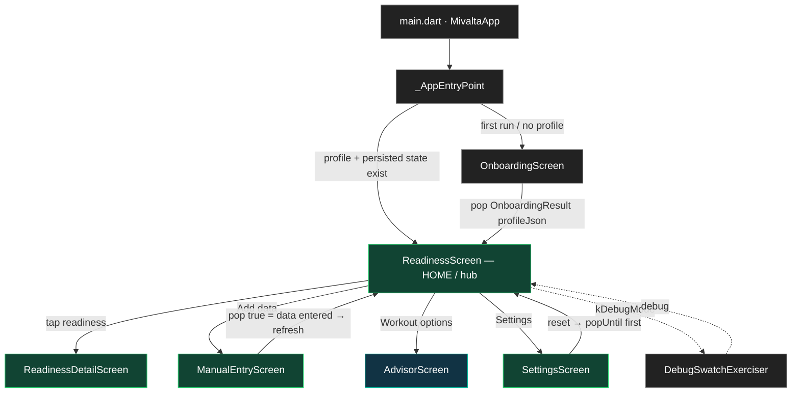
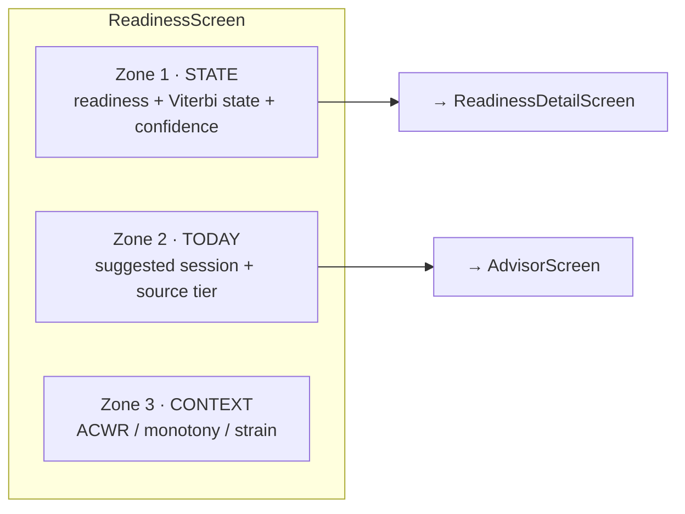
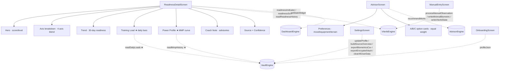
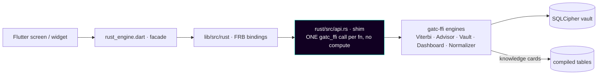

# MiValta Flutter — UI/UX Flow, Screens & Wiring

Status: living map. Date: 2026-06-06. Source: read from `lib/` (not from spec).
Reconciles to `UI_UX_DIRECTION.md` (rust-engine) and the engine pin in `rust/Cargo.toml`.

Principle (every arrow obeys it): **the Rust engine DECIDES/COMPUTES, the FFI PASSES
THROUGH, Flutter DISPLAYS.** No thresholds/math/fabrication in Dart.

---

## 1. Navigation flow (screens + subscreens)

**Tiers** (per `UI_UX_DIRECTION` v1.4 + DECISIONS Entry X):
- 🟢 **MONITOR** (free, no Josi): `ReadinessScreen`, `ReadinessDetailScreen`, `ManualEntryScreen`, `SettingsScreen`, `OnboardingScreen`.
- 🔵 **ADVISOR** (Josi layer): `AdvisorScreen` (bounded A/B/C; humanized voice deferred to PR-F).
- ⚪ **COACH** (post-beta): planning / open conversation — not yet built.

---

## 2. ReadinessScreen — the hub (three-zone PULL home)

Engine wiring (facade calls): `readinessIndicator`, `readinessScore`,
`viterbiFatigueState`, `zoneCapWithAdvisories`, `getStateWidget`,
`getSessionWidget`, `getContextWidget`, `readReadinessHistory`,
`lastObservationSourceTier`. Lifecycle: `readPersistedState` →
`constructEnginesFromState` | `constructEnginesFresh` → `saveState` →
`writeViterbiState`. Auto data sync via `HealthIngestService`.

---

## 3. Subscreen composition + engine wiring

`★` = the analytics surfaces wired in PR #44 via **pure pass-through** FFI
(`read_daily_loads`, `read_mmp_history`).

---

## 4. The data wiring (engine → display), one layer at a time

- **Shim is pure transport** (rule: zero computation in the bridge).
- **Dart is display-only** (no thresholds/math/fallback).
- **External data in**: `HealthIngestService` (Health Connect / HealthKit) →
  `processObservation`; or `ManualEntryScreen` → `processManualObservation`.

---

## 5. Screen inventory (source of truth)

| Screen | File | Tier | Returns | Key engine calls |
|---|---|---|---|---|
| AppEntryPoint | `main.dart` | — | — | `readPersistedState`, `constructEngines*` |
| OnboardingScreen | `screens/onboarding_screen.dart` | Monitor | `OnboardingResult(profileJson)` | (ProfileService → vault) |
| **ReadinessScreen** (hub) | `screens/readiness_screen.dart` | Monitor | — | `readinessIndicator`, `getStateWidget`, `getSessionWidget`, `getContextWidget`, … |
| ReadinessDetailScreen | `screens/readiness_detail_screen.dart` | Monitor | — | `readinessIndicator`, `readReadinessHistory`, `readDailyLoads ★`, `readMmpHistory ★` |
| AdvisorScreen | `screens/advisor_screen.dart` | Advisor | — | `recommendWorkout` |
| ManualEntryScreen | `screens/manual_entry_screen.dart` | Monitor | `bool` (data entered) | `processManualObservation`, `writeMinimalBiometric` |
| SettingsScreen | `screens/settings_screen.dart` | Monitor | varies | `updateProfile`, `exportEncryptedVault`, `clearAllUserData` |
| DebugSwatchExerciser | `screens/debug_swatch_exerciser.dart` | debug | — | — |

★ wired in PR #44 (pure pass-through). Analytics surfaces still to wire
(roadmap): PMC fitness series, workout-detail composite (need new engine getters).
