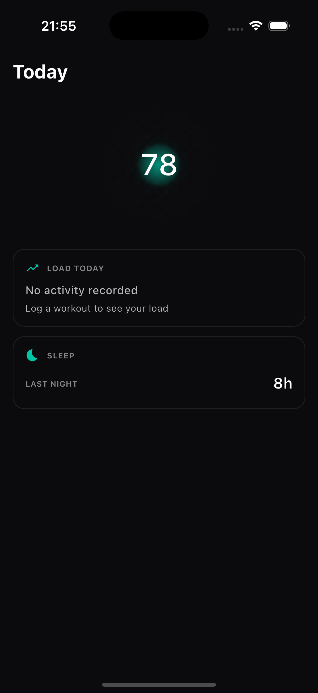

# Today Screen — Build Report v2 (SHA-stamped)

**Branch:** `feature/today-fresh-build`
**Commit:** `eb42c02`
**Date:** 2026-06-30
**Status:** Reconciliation — live build documented

## SHA-stamped screenshot

**This is the live build as of SHA `eb42c02`.**

## What the live build ACTUALLY shows

| Element | Present | Notes |
|---------|---------|-------|
| "Today" title | ✓ | Left-aligned per DR-001 |
| Glow hero | ✓ | Teal (#00C6A7), but too tight/saturated |
| Score "78" | ✓ | Engine-computed readiness |
| State word (Recovered/Productive) | ✗ | **MISSING** — glow meaningless without it |
| Josi line | ✗ | **MISSING** — collapsed (state_recommendation null) |
| Decision chip | ✗ | **MISSING** |
| Load Today card | ✓ | Honest-absence: "No activity recorded" |
| Sleep card | ✓ | Real data: "8h" |
| Daily-activity card | ✗ | **MISSING** |
| Suggested-workout card | ✗ | **MISSING** |
| Bottom nav (Today/Journey/You) | ✗ | **MISSING** |

## Reconciliation

The reviewed screenshot (`today_dr001_fixed.png`) showed elements not present in this live build:
- State word under glow
- Decision chip
- Suggested-workout block

**Root cause:** That screenshot was ahead of / not from this build. The live build at `eb42c02` never had those elements.

## Gaps to fix (DR-002 + ADDENDUM)

1. **State word** — Add "Productive" / "Recovered" label under the score
2. **Josi line (I1)** — Must render when state_recommendation exists; currently null-collapsed
3. **Decision chip** — Add below Josi line
4. **Daily-activity card** — Add with honest-absence pattern
5. **Suggested-workout card** — Add with honest-absence pattern
6. **Bottom nav** — Add Today/Journey/You tab bar
7. **Glow softening** — Two-layer radial field per design spec

## Test status

- `flutter analyze`: No issues found
- `flutter test`: All 235 tests pass

## Next

Fix all gaps, re-shoot at new SHA, push for DR-003.
