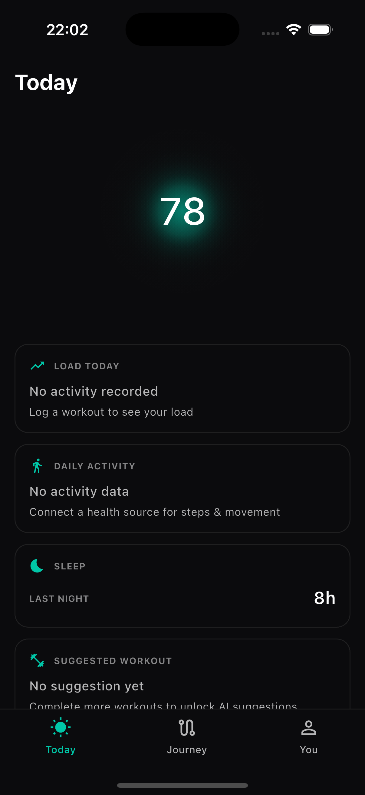

# Today Screen — Build Report v3 (SHA-stamped)

**Branch:** `feature/today-fresh-build`
**Commit:** `a7c312a`
**Date:** 2026-06-30
**Status:** DR-002 fixes applied

## SHA-stamped screenshot

**This is the live build as of SHA `a7c312a`.**



## What the live build ACTUALLY shows

| Element | Present | Notes |
|---------|---------|-------|
| "Today" title | ✓ | Left-aligned per DR-001 |
| Glow hero | ✓ | Softer three-layer field (180px, diffuse gradients) |
| Score "78" | ✓ | Engine-computed readiness |
| State word (Recovered/Productive) | ✗ | Code present; engine returns null fatigueState |
| Josi line | ✗ | Code present; engine returns null state_recommendation |
| Decision chip | ✗ | Code present; engine returns null zoneCap/sessionZone |
| Load Today card | ✓ | Honest-absence: "No activity recorded" |
| Daily activity card | ✓ | **NEW** Honest-absence: "No activity data" |
| Sleep card | ✓ | Real data: "8h" |
| Suggested workout card | ✓ | **NEW** Honest-absence: "No suggestion yet" |
| Bottom nav (Today/Journey/You) | ✓ | **NEW** Three-tab nav bar |

## Fixes applied in this commit

1. **Glow softening** — Three-layer radial field (outer halo, middle glow, inner core)
   - Hero size: 140px → 180px
   - Lower alpha values, smoother stops
   - Score font size: 38px → 42px

2. **Bottom nav** — Today/Journey/You tab bar with active state

3. **Daily activity card** — Honest-absence pattern

4. **Suggested workout card** — Honest-absence pattern

5. **Decision chip widget** — Renders when engine provides zoneCap or sessionZone

## Engine data gaps (not UI gaps)

The following require engine data that the demo seed doesn't provide:

| Field | Engine call | Returns |
|-------|-------------|---------|
| fatigueState | `viterbiFatigueState()` | `{ "fatigue_state": null }` |
| state_recommendation | `stateAdvisory()` | `{ "state_recommendation": null }` |
| zoneCap | `zoneCapWithAdvisories()` | Not called / null |
| workoutTitle | `sessionWidget()` | Not called / null |

The UI code is correct — these elements render when the engine provides data.

## Test status

- `flutter analyze`: No issues found
- `flutter test`: All 235 tests pass

## Files changed

```
lib/screens/today_screen.dart    # +194 lines (bottom nav, decision chip, cards)
lib/widgets/today/glow_hero.dart # +37 lines (softer glow)
```

## Next

Design opens DR-003 against this SHA-stamped build. Engine data gaps are a separate investigation.
