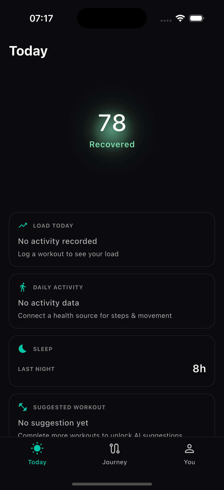

# Today Screen — Build Report v4 (Baseline for DR-003 instructions)

**Branch:** `feature/today-fresh-build`
**Commit:** `2b2edc9`
**Date:** 2026-07-01
**Status:** Baseline established

---

## SHA-Stamped Screenshot

**This is the live build as of SHA `2b2edc9`.**

**Screen:** Today
**Task completed:** Josi absence traced, state word wiring fixed

---

## Current State — What Renders

| Element | Status | Detail |
|---------|--------|--------|
| "Today" title | ✓ Real | Left-aligned, Inter 700 |
| Glow hero | ✓ Real | Three-layer soft field |
| Score "78" | ✓ Real | Engine-computed readiness |
| State word "Recovered" | ✓ Real | Mint #7FE3B0, wiring fixed |
| Josi line | Honest-absent | Traced: advisories not attached (seeder gap) |
| Decision chip | Build gap | Accessor not wired |
| Load Today card | Honest-absent | "No activity recorded" |
| Daily Activity card | Honest-absent | "No activity data" |
| Sleep card | ✓ Real | "8h" from seeded biometrics |
| Suggested Workout card | Honest-absent | "No suggestion yet" |
| Bottom nav | ✓ Real | Today (active) / Journey / You |

---

## Open Items

### Blocking (M1)

| ID | Issue | Current | Expected |
|----|-------|---------|----------|
| M1 | Card titles | "LOAD TODAY" (ALL CAPS) | "Load today" (Title Case) |

### Non-blocking

| ID | Issue | Status |
|----|-------|--------|
| G1 | Glow ellipse (Y-stretch) | Open |
| G3 | State word spacing (6px → 12px) | Open |
| L1 | Hero vertical compression | Open |
| C1 | Decision chip accessor wiring | Open |

### Traced Genuine Absences (not bugs)

| Element | Root Cause |
|---------|------------|
| Josi line | Engine: "advisories not attached" — seeder gap |
| Decision chip | Accessor (`zoneCapWithAdvisories`) not wired |

---

## Screenshot Log

| SHA | Filename | Task | Date |
|-----|----------|------|------|
| `eb42c02` | `today_eb42c02_live.png` | Initial reconciliation | 2026-06-30 |
| `a7c312a` | `today_a7c312a_live.png` | DR-002 fixes (nav, cards, glow) | 2026-06-30 |
| `5e46e4e` | `today_5e46e4e_live.png` | State word wiring fix | 2026-06-30 |
| `2b2edc9` | `today_2b2edc9_live.png` | **Baseline for DR-003** | 2026-07-01 |

---

## Next

Claude Design issues 1:1 instructions against this baseline.
