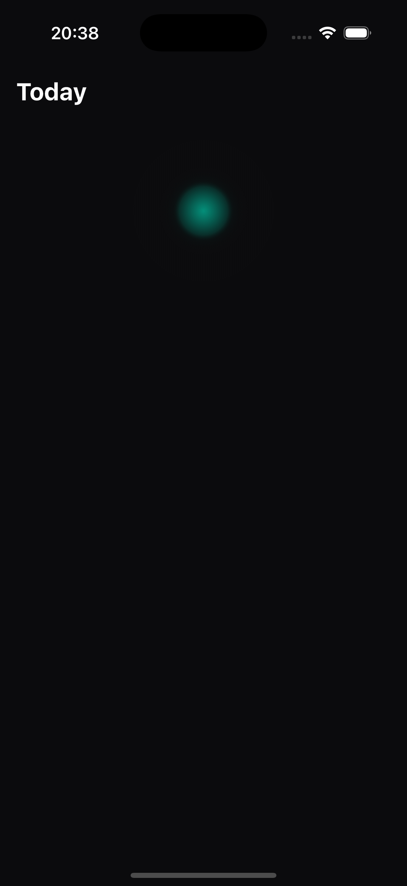

# Today Screen — Build Report v1

**Branch:** `feature/today-fresh-build`
**Date:** 2026-06-30
**Status:** Ready for design review

## What was built

Fresh Today screen from Claude Design specs (`Today-Modular.html`, `Today-Composition.html`, `tokens/*.css`).

### Structure

```
lib/
├── main.dart                      # Entry → TodayScreen
├── screens/
│   └── today_screen.dart          # Today screen with engine wiring
└── widgets/today/
    ├── glow_hero.dart             # Radial glow hero widget
    ├── josi_card.dart             # Josi line card with **bold** support
    └── module_card.dart           # Base module card + MetricRow + ProgressBar
```

### DR-001 corrections applied

| Correction | Implementation |
|------------|----------------|
| Hero number in Inter (not Zen Dots) | `fontFamily: 'Inter'` in GlowHero |
| Recovered = #7FE3B0 | `MivaltaColors.stateRecovered` mapped |
| "Today" left-aligned | `centerTitle: false` in SliverAppBar |
| Josi from state_recommendation | `_data.realizedLine?.text ?? _data.stateRecommendation` |

### Tokens used

| Token | Value | Source |
|-------|-------|--------|
| `--surface-background` | #0B0B0D | `MivaltaColors.surfaceBackground` |
| `--state-productive` | #00C6A7 | `MivaltaColors.stateProductive` |
| `--state-recovered` | #7FE3B0 | `MivaltaColors.stateRecovered` |
| `--text-primary` | #FFFFFF | `MivaltaColors.textPrimary` |
| `--radius-md` | 15px | Card border radius |
| `--space-x3` | 12px | Card gaps |

### Engine wiring

Wired to real engine data via preserved HomeData plumbing:

- `readinessIndicator()` → score, confidence, level, contributions
- `stateAdvisory()` → state_recommendation (Josi line)
- `viterbiFatigueState()` → fatigue_state (glow color)
- `realizeAdvisorLine()` → firewall-validated Josi line
- `readDailyLoads()` → todayLoad (module card)
- `readBiometricHistory()` → lastNightSleepHours (module card)

## Screenshots

### Honest absence (no profile/data)



Shows:
- "Today" left-aligned ✓
- Glow hero with radial gradient (productive teal fallback) ✓
- No fabricated score — honest absence ✓

## Test status

- `flutter analyze`: No issues found
- `flutter test`: All 235 tests pass

## Gaps / follow-up

1. **No edit mode** — per brief, edit mode is a follow-up
2. **No decision chip** — to be added after design confirms hero layout
3. **Inter font** — using system font; Inter needs to be bundled as asset
4. **Onboarding flow** — needed to get a profile for real data screenshot

## Next

Design opens the next review round. Iterate to "matches." Hold for Bart's gate (real-data + merge).
